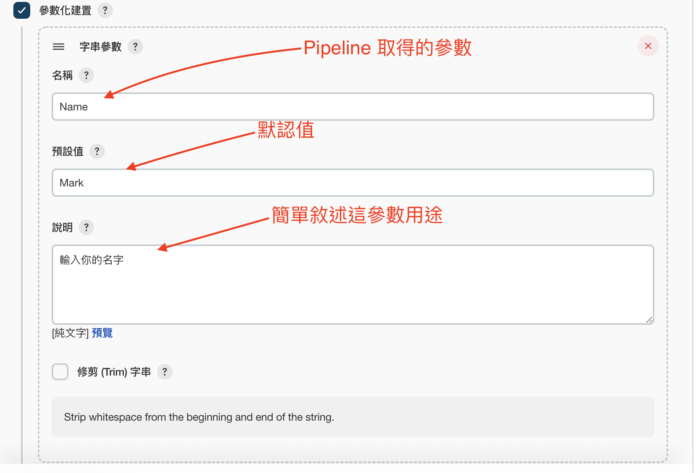

# Mac 架設 Jenkins 以及 Pipeline 操作

## 安裝 Jenkins

你可以參考 Jenkins 官方文檔中提供的[安裝指南](https://www.jenkins.io/doc/book/installing/macos/)。使用 Homebrew 可以方便地在本地安裝 Jenkins：

```bash
# 執行下方指令可將 Jenkins 安裝到本地端
$ brew install jenkins-lts
```

## 啟動 Jenkins

執行以下指令可以啟動 Jenkins 伺服器，並指定地址和端口：

```bash
$ /usr/local/opt/openjdk@11/bin/java -Dmail.smtp.starttls.enable=true -jar /usr/local/opt/jenkins-lts/libexec/jenkins.war --httpListenAddress=127.0.0.1 --httpPort=8080
```

## 開啟 Jenkins

打開瀏覽器並輸入以下網址以訪問 Jenkins：

[http://127.0.0.1:8080/](http://127.0.0.1:8080/)

## 取得 Jenkins 密碼

第一次訪問 Jenkins 時，你需要輸入一個密碼。可以使用以下指令獲取密碼：

```bash
$ cat /Users/mark/.jenkins/secrets/initialAdminPassword
```

此外，之後還需要設定帳號密碼，可以按照自己的需求進行設定。

## 安裝 Robot Framework 套件

這個流程是可選的，如果需要安裝 Jenkins 相關套件，可以透過 Jenkins 管理界面中的外掛程式進行操作。

## 建立一個新的專案

在 Jenkins 首頁上，點擊新增作業，然後輸入專案名稱、選擇建立專案的方式（建議使用 Pipeline），最後點擊確認。

Jenkins 專案區塊簡易說明：
1. **一般**：敘述專案用途、給予參數、GitHub 設定等。
2. **建構觸發器**：設定專案觸發的方式。
3. **高級項目選項**：其他進階設定。
4. **Pipeline**：用於編寫自定義腳本的區塊。


## General 參數化建置

介紹了一些有用的參數類型，如字串參數、密碼參數、布林參數、文字參數、選擇參數。


**字串參數：**
- 輸入名稱：Pipeline 會取得名稱的參數。
- 默認值：可以給予空值或你想預設的參數。



**密碼參數：**
- 輸入名稱：Pipeline 會取得名稱的參數。
- 默認值：可以給予空值或你想預設的參數。


**布林值參數：**
- 輸入名稱：Pipeline 會取得名稱的參數。
- 預設值：勾選代表預設為 True。


**文字參數：**
- 輸入名稱：Pipeline 會取得名稱的參數。
- 默認值：可以給予空值或你想預設的參數。


**選擇參數：**
- 輸入名稱：Pipeline 會取得名稱的參數。
- 選項：預設為第一個，後面顯示下拉式方式顯示。


## 建構觸發器 定時器

簡單敘述了一些定時觸發的方法，使用五個參數值分別表示分、小時、日、月和星期。

- 每1分鐘執行一次專案
- 每5分鐘執行一次專案
- 每1小時執行一次專案
- 每天早上10點0-10分內，執行一次專案
- 每月的5,15,25日，晚上6點0-10分內，執行一次專案
- 每年6,12月，晚上8點30-35分內，執行一次專案


每1分鐘執行一次專案


每5分鐘執行一次專案


每1小時執行一次專案


每天早上10點0-10分內，執行一次專案


每月的5,15,25日，晚上6點0~10分內，執行一次專案


每年6,12月，晚上8點30-35分內，執行一次專案


每星期1至5，早上8點到12點0-5分內，執行一次專案


## 如何編寫 Jenkins Pipeline 腳本

1. Name
2. Token
3. isQA
4. Message

我們透過上面獲取的參數來編寫一下簡單腳本

```bash
pipeline {
    agent any

    stages {
        stage('Name') {
            steps {
                echo "你的名字是: ${Name}"
                script{
                    if ("${Name}" == 'Mark') {
                        echo "我是${Name}"
                    } else {
                        echo "我不是Mark，我是${Name}"
                    }
                }
            }
        }
        stage('Token') {
            steps {
                echo "密碼是: ${Token}"
            }
        }
        stage('isQA') {
            steps {
                echo '單引號不會出現參數: ${isQA}'
                echo "你是不是QA: ${isQA}"
                script{
                    if("${isQA}" == "true"){
                        echo "判斷我是QA"
                    }else{
                        echo "判斷我不是QA"
                    }
                }

            }
        }
        stage('Message') {
            steps {
                echo "你說的訊息是: ${Message}"
            }
        }
        stage('location') {
            steps {
                echo "你現在位置: ${location}"
                script{
                    if("${location}" == "新北"){
                        echo "不錯的地點"
                    } else if ("${location}" == "台北"){
                        echo "人口密度高的地方"
                    } else if ("${location}" == "柬埔寨"){
                        echo "要小心"
                    }

                }
            }
        }
        stage("command"){
            steps{
                sh 'ls -l'
            }
        }
        stage("Script"){
            steps{
                echo "Run Script"

                script {
                    def times = ['gary', 'ron', 'mark']
                    for (int i = 0; i < times.size(); ++i) {
                        echo "他是: ${times[i]}"
                    }
                }
            }
        }
    }
}
```

## 複製舊的專案到新的專案

首先先回到Jenkins首頁，點擊新增作業(在點擊新增作業前，將想要舊專案的名稱複製下來)


輸入新的專案名稱，接著往下滑動


**將舊專案的資料複製一筆到 QAReviewMeetingTestPubilc**


## 串接個人GitHub 公有庫 QAReviewMeetingTestPublic

先到個人GitHub取得對應的公有庫連結，此公有庫有兩個分支 main, test


回到 Jenkins QAReviewMeetingTestPublic 新的專案，透過組態去新增我們的GitHub到專案，移動到最下方點擊 **Pipeline Syntax**


**獲取 GitHub Pipeline Script**

1. Sample Step 選擇 Git
2. Repository URL 將GitHub連結貼上
3. Branch 選擇 main 或其他預設
4. 點擊 Generate Pipeline Script
5. 複製字串，這就是Pipeline Script產生出來的指令(會去Github上抓取對應的庫到本地端進行操作)


接下來針對Jenkins專案，新增一個參數以及新增兩個 stage 至於怎麼新增參數跟stage上面有簡易介紹，我直接貼上腳本以及多新增的參數欄位


```bash
pipeline {
    agent any

    stages {
        // Build為新增的區塊
        stage('Build'){
            steps{
                git branch: "${Branch}", url: 'https://github.com/MarkwwLiu/QAReviewMeetingTestPublic.git'
            }
        }
        stage('Name') {
            steps {
                echo "你的名字是: ${Name}"
                script{
                    if ("${Name}" == 'Mark') {
                        echo "我是${Name}"
                    } else {
                        echo "我不是Mark，我是${Name}"
                    }
                }
            }
        }
        stage('Token') {
            steps {
                echo "密碼是: ${Token}"
            }
        }
        stage('isQA') {
            steps {
                echo '單引號不會出現參數: ${isQA}'
                echo "你是不是QA: ${isQA}"
                script{
                    if("${isQA}" == "true"){
                        echo "判斷我是QA"
                    }else{
                        echo "判斷我不是QA"
                    }
                }

            }
        }
        stage('Message') {
            steps {
                echo "你說的訊息是: ${Message}"
            }
        }
        stage("command"){
            steps{
                sh 'ls -l'
            }
        }
        stage("Script"){
            steps{
                echo "Run Script"

                script {
                    def times = ['gary', 'ron', 'mark']
                    for (int i = 0; i < times.size(); ++i) {
                        echo "他是: ${times[i]}"
                    }
                }
            }
        }
        // 印出程式碼內容
        stage("Python"){
            steps{
                sh 'python3 main.py'
            }
        }
    }
}
```

## 串接個人 GitHub 私有庫 QAReviewMeetingTestPrivate

首先可以直接複製一份 QAReviewMeetingTestPublic 專案 並取名為 QAReviewMeetingTestPrivate

其實跟公有庫差不多，差異只有在於需要一個token才能夠順利下載到本地端，那到底該如何獲取Token呢？可以參考下方圖示

**取得GitHub Token流程**

透過GitHub 個人設定頁面左下角點擊 Developer settings


1. 點擊 Personal access tokens
2. 點擊Generate new token


1. Note輸入名稱
2. 可以選擇token期限，預設是30天
3. 勾選repo權限


點擊 Generate Token


可在Personal access tokens 看到剛建立的token


回到Jenkins首頁，點擊管理Jenkins


點擊 Manage Credentials


點擊 global 會展開 Add credential 點擊鑰匙


1. Scope選擇Global
2. Username 輸入你的GitHub帳號
3. Password 輸入剛獲取的token
4. ID 可依照自己方式輸入
5. Description 可為這組ID多做些介紹
6. 直接點擊Create


接回會回到 Manage Credentials 區塊，可查看到上方已經建立好一個證書


**修改 Pipeline腳本**

將我們從 QAReviewMeetingTestPubilc 複製到 QAReviewMeetingTestPrivate 做些微調

到組態頁面 移動到最下方 點擊 Pipeline Syntax，將我們私有庫的連結貼上，跟公有庫差不多

只差於第四點要選擇以及產生來的腳本多帶一個參數


最後提供完整的Piplink腳本

```bash
pipeline {
    agent any

    stages {
        // Build為新增的區塊
        stage('Build'){
            steps{
                git branch: "${Branch}", credentialsId: 'GitHubToken', url: 'https://github.com/MarkwwLiu/QAReviewMeetingTestPrivate.git'
            }
        }
        stage('Name') {
            steps {
                echo "你的名字是: ${Name}"
                script{
                    if ("${Name}" == 'Mark') {
                        echo "我是${Name}"
                    } else {
                        echo "我不是Mark，我是${Name}"
                    }
                }
            }
        }
        stage('Token') {
            steps {
                echo "密碼是: ${Token}"
            }
        }
        stage('isQA') {
            steps {
                echo '單引號不會出現參數: ${isQA}'
                echo "你是不是QA: ${isQA}"
                script{
                    if("${isQA}" == "true"){
                        echo "判斷我是QA"
                    }else{
                        echo "判斷我不是QA"
                    }
                }

            }
        }
        stage('Message') {
            steps {
                echo "你說的訊息是: ${Message}"
            }
        }
        stage('location') {
            steps {
                echo "你現在位置: ${location}"
                script{
                    if("${location}" == "新北"){
                        echo "不錯的地點"
                    } else if ("${location}" == "台北"){
                        echo "人口密度高的地方"
                    } else if ("${location}" == "柬埔寨"){
                        echo "要小心"
                    }

                }
            }
        }
        stage("command"){
            steps{
                sh 'ls -l'
            }
        }
        stage("Script"){
            steps{
                echo "Run Script"

                script {
                    def times = ['gary', 'ron', 'mark']
                    for (int i = 0; i < times.size(); ++i) {
                        echo "他是: ${times[i]}"
                    }
                }
            }
        }
        // 印出程式碼內容
        stage("Python"){
            steps{
                sh 'python3 main.py'
            }
        }
    }
}
```

git branch: "${Branch}", url: '[https://github.com/MarkwwLiu/QAReviewMeetingTestPublic.git](https://github.com/MarkwwLiu/QAReviewMeetingTestPublic.git)'

## Robot Framework Pipeline腳本

```bash
pipeline {
    agent any
    stages {
        stage('Test') {
            steps {
                echo 'Test...'
            }
        }
        stage('Web Automation') {
            parallel {
                stage('Git Clone') {
                    steps {
                        echo 'Git Clone...'
                        git branch: '${Branch}', credentialsId: 'GitHubToken', url: 'https://github.com/MarkwwLiu/robot_test.git'
                    }
                }
                stage('Run Auto Web Tests') {
                    steps {
                        script{
                            echo 'Auto Test..'
                            if ("${Command}"==""){
                            	sh "python3 -m robot -d report tests/"
                            }else{
                            	sh "python3 -m robot -d report ${Command}"
                            }
                            sh 'exit 0'
                        }
                    }
                    post {
                        always {
                            script {
                                step(
            			            [
            			              $class              : 'RobotPublisher',
            			              outputPath          : 'report',
            			              outputFileName      : 'output.xml',
            			              reportFileName      : 'report.html',
            			              logFileName         : 'log.html',
            			              disableArchiveOutput: false,
            			              passThreshold       : 50,
            			              unstableThreshold   : 40,
            			              otherFiles          : "*/*.png,*/*.jpg",
            			            ]
        		          	    )
        		            }
                        }
                    }
                }
                stage('Send Slack notification message') {
                    steps {
                        echo 'Send Slack notification message'
                    }
                }
                stage('Test1') {
                    steps {
                        echo 'MARK...'
                    }
                }
            }
        }

    }
}
```

## Q & A

### Q:

RobotFramework 點擊log or report 無法顯示


### A:

可透過兩種方式解決此問題

1. 呼叫Jenkins伺服器使用下方指令

```bash
$ /usr/local/opt/openjdk@11/bin/java -Dmail.smtp.starttls.enable=true -Dhudson.model.DirectoryBrowserSupport.CSP= -jar /usr/local/opt/jenkins-lts/libexec/jenkins.war --httpListenAddress=127.0.0.1 --httpPort=8080
```

1. 另外一種解決方法就是在jenkins Script主控台上輸入下指令可解決此問題，第二需待確認
    1. Jenkins Script 主控台位置可參考下方圖片說明

```bash
System.setProperty("hudson.model.DirectoryBrowserSupport.CSP", "")
```

```bash
System.setProperty("hudson.model.DirectoryBrowserSupport.CSP","sandbox allow-scripts; default-src 'none'; img-src 'self' data: ; style-src 'self' 'unsafe-inline' data: ; script-src 'self' 'unsafe-inline' 'unsafe-eval' ;")
```


執行後，不會有任何資料產生，可直接回到專案內點擊報告測試確認


參考資料來源：

[https://www.jenkins.io/](https://www.jenkins.io/)

[https://developer.aliyun.com/article/487579](https://developer.aliyun.com/article/487579)


#### 關於我的連結
- GitHub: https://github.com/MarkwwLiu
- Facebook: https://www.facebook.com/TestMrMark
- Linkedin: https://www.linkedin.com/in/%E7%B4%8B%E7%91%8B-%E5%8A%89-03356584/
- CakeResume: https://www.cakeresume.com/me/ak790718
